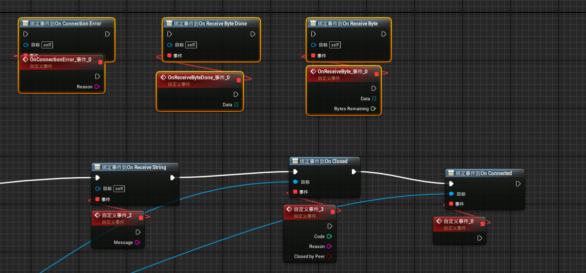

# UnrealSuperWebSocket
-  [English](./READMEResource/README.en.md)
-  [简体中文](./READMEResource/README.zh_CH.md)
  
## 1.简介
1. 本插件是为HTML5平台开发的WebSocket通信插件。该插件在4.27版本上测试没有发现任何问题。但是在使用之前需要配置好依赖库环境。
2. 本插件由[Xi3Chen(bilibili)](https://space.bilibili.com/320495524?spm_id_from=333.1007.0.0)开发，禁止售卖。
3. 该插件由以下金主赞助
   
[风中追风iiiiiiiiiiiiiie](https://space.bilibili.com/25082692)

## 安装
### 1. 复制插件到项目中
将该插件下载复制到C++项目路径下的Plugins文件夹下，如图

### 2. 重构你的C++ VisualStudio项目
先右键你的项目然后点击Generate Visual Studio Project files。过程种可能卡住请点击

   

   ***Tips:*** 生成过程中可能进度条会卡住。点击窗口的show Log按钮出现了以下报错：`Please Reset LibraryConfig.conf. Press Enter to continue...`。请关掉该窗口并确保插件的目录下Resources文件夹内有`LibraryConfig.conf`文件
   
   如下图创建一个名叫`LibraryConfig.conf`的文本文件
   

### 3. 配置你的EMSDK环境

打开工程后点击菜单栏下的UnrealSuperWebSocketEditSettings。然后检查UnrealInstallPath后的路径是否为你的引擎安装路径。并且检查你的EMSDK版本号是否匹配。检查方式：打开`你的引擎安装路径\Engine\Platforms\HTML5\Build\emsdk`下的文件夹名字是否与弹窗中现实的信息相匹配。如果不匹配或者为空，请点击重试按钮。如果重试之后依然无法匹配。请手动修改`LibraryConfig.conf`文件。在EMSDK_Version等于后面的双引号中填入你的EMSDK版本信息。

### 4. 如何使用
1. 蓝图中右键输入`websocketsubsystem`并且调用Subsystem中的Connect函数。请右键将ReturnValue提升为变量。之后接收发送数据等都依赖这个对象。
2. 以下是WebSocketProxy类中的函数和委托。按需使用

   函数：

   

   委托：
   
