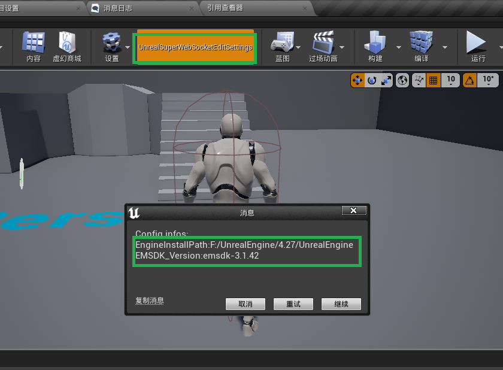

# UnrealSuperWebSocket
-  [English](./README.en.md)
-  [简体中文](./README.zh_CH.md)
## 1. Introduction

1. This plugin is a WebSocket communication plugin developed for the HTML5 platform. The plugin has been tested on version 4.27 without any issues. However, you need to configure the dependency library environment before using it.
2. This plugin is developed by [Xi3Chen(bilibili)](https://space.bilibili.com/320495524?spm_id_from=333.1007.0.0) and is not for sale.
3. The plugin is sponsored by the following patron:
   
[风中追风iiiiiiiiiiiiiie](https://space.bilibili.com/25082692)

## Installation
### 1. Copy the plugin to your project
Download and copy the plugin to the Plugins folder under the path of your C++ project, as shown below:

### 2. Regenerate your C++ Visual Studio project
First, right-click your project and then click Generate Visual Studio Project files. If the process gets stuck, please click:

   

   ***Tips:*** The progress bar may get stuck during the generation process. If the window shows the following error after clicking the show Log button: `Please Reset LibraryConfig.conf. Press Enter to continue...`, please close the window and ensure that there is a `LibraryConfig.conf` file in the Resources folder under the plugin directory.
   
   
   
   Create a text file named `LibraryConfig.conf` as shown below:
   
   

### 3. Configure your EMSDK environment

After opening the project, click UnrealSuperWebSocketEditSettings under the menu bar. Then check if the path after UnrealInstallPath is your engine installation path. Also, check if your EMSDK version matches. To check: open the folder under `your engine installation path\Engine\Platforms\HTML5\Build\emsdk` and see if the folder name matches the information displayed in the pop-up window. If it doesn't match or is empty, click the retry button. If it still doesn't match after retrying, manually modify the `LibraryConfig.conf` file. Fill in your EMSDK version information within the double quotes after EMSDK_Version.

### 4. How to use
1. Right-click in the blueprint and input `websocketsubsystem`, then call the Connect function in the Subsystem. Right-click to promote the ReturnValue to a variable. Subsequent data reception and sending will depend on this object.
2. The following are the functions and delegates in the WebSocketProxy class. Use them as needed.

   Functions:

   

   Delegates:
   
   
